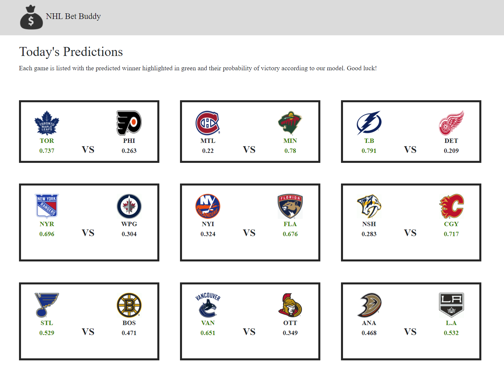

# Engineering Project Write-up
## NHL Game Outcome Prediction App

### Abstract
As sports betting has become increasingly legalized across the country, the demand for information around making those bets has as well. The goal of this project was to work with data engineering techniques to create a pipeline that feeds a machine learning model to predict the outcome of NHL games on a daily basis. I used data from three sources: [NaturalStatTrick](naturalstattrick.com), [fivethirtyeight](https://github.com/fivethirtyeight/data/tree/master/nhl-forecasts), and [NHL API](https://gitlab.com/dword4/nhlapi) to build a pipeline that pulls from these sources daily, stores the data in a PostgreSQL database, trains a Logistic Regression model, and finally outputs the predictions to be displayed in a Flask app.

### Design
This project was inspired by [fivethirtyeight](https://projects.fivethirtyeight.com/2022-nhl-predictions/games/). The challenge was to create an accurate outcome model for NHL games that updates daily. Accurate prediction of game outcomes could lead to a large payout given the right betting strategy. 

### Data
The pipeline retrieves data from three sources
- [NaturalStatTrick](naturalstattrick.com), a website that hosts advanced stats for NHL games
- [fivethirtyeight](https://github.com/fivethirtyeight/data/tree/master/nhl-forecasts), ELO ratings for NHL teams hosted 
- [NHL API](https://gitlab.com/dword4/nhlapi), the publicly available API hosted by the NHL

Data is retrieved for team level statistics for each game played, then aggregated and merged into features to be used in training the model and outputting predictions.

### Algorithms
The dataset is created by web scraping three seasons worth of historical data as a baseline, then scraping new rows on a daily basis. All data is stored in a PostgreSQL database, merging and feature engineering performed with SQL commands executed via Python scripts with SQLAlchemy.

#### Featuring Engineering
- To normalize and account for streaks, advanced team statistics were merged and aggregated into rates over the team's last half season (41 games), including:
	+ Fenwick %
	+ Goals for %
	+ Expected Goals for %
	+ Shooting %
	+ Power Play Goals for/min
	+ Power Play Expected Goals for/min
	+ Penalty Kill Goals against/min
	+ Penalty Kill Expected Goals against/min
- A categorical feature was included for back to back games
- Team ELO rating
- Features were merged for each game into a set of features for both the home and away team
- Numeric features are scaled and categorical features one hot encoded before being used by the model

#### Modeling
- Target to predict is whether the home team wins given the features for home and away
- Testing performed on:
	+ Logistic Regression 
	+ XGBoost
	+ Neural Network
- Selected Logistic Regression model 
	+ Accuracy: 54%
	+ Log Loss: 0.6684

#### Orchestration and Display
- A cron job runs Python files every morning to fetch the previous days stats and the current days games, train and run the model, and output the results to the database
- A Flask front end displays the matchups between each team, along with the predicted winner's name in green and the probability output of the model. 

### Tools
- Requests/Hockey Scraper for web scraping
- Numpy/Pandas for data handling
- PostgreSQL and SQLAlchemy for data storage
- sklearn for ML model
- Flask for front end display of model results
- cron for orchestration

### Communication
Along with this write-up, slides will be presented and the app available on my Github page
